

# Midnight Kiss
Midnight kiss is a theme for the [Pterodactyl Panel](https://github.com/pterodactyl) developed by the team here at [elasthicc](https://elasthi.cc). This is a dark mode focused theme designed for pterodactyl 1.0+ which includes curated material design colors that are effective and pleasing to the eyes. We decided to keep it simple silly so anyone can add it to their panel. Checkout the [installing](#installing) section if you'd like to install it too!

  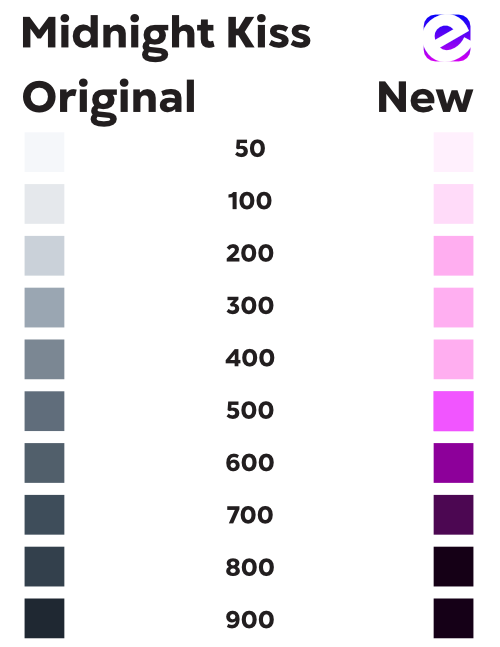

## Installing
Simply replace the files found in the `panel/` directory into your pterodactyl directory, usually found in `/var/www/pterodactyl/`. You will need to rebuild your panel assets, check out [this guide](https://pterodactyl.io/community/customization/panel.html) if you are unfamiliar.

## Examples

  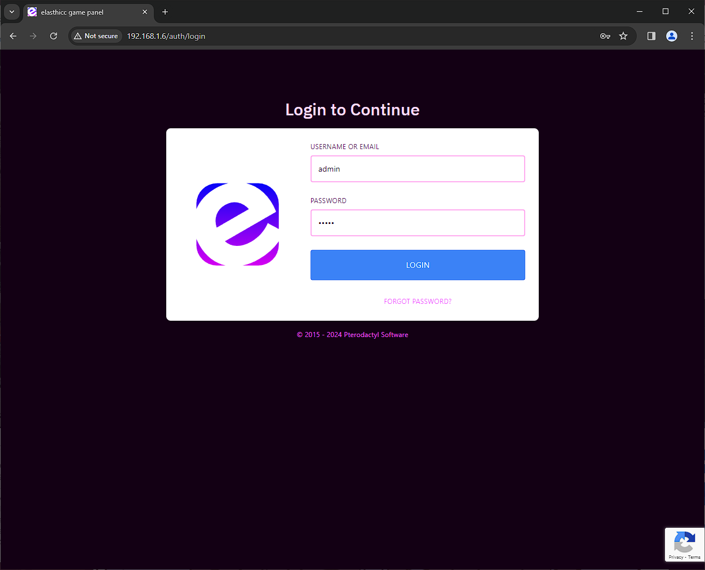
  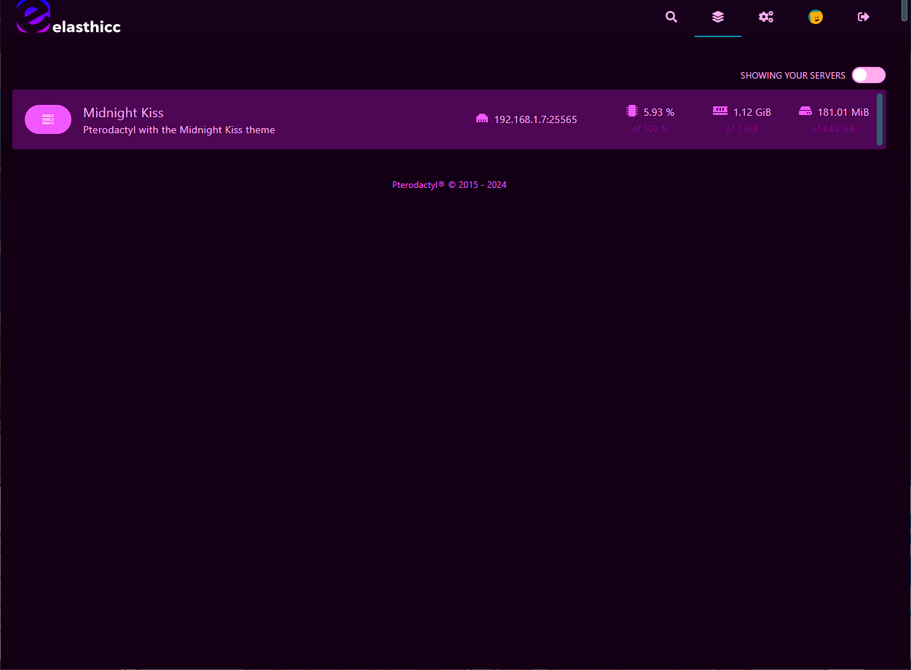
  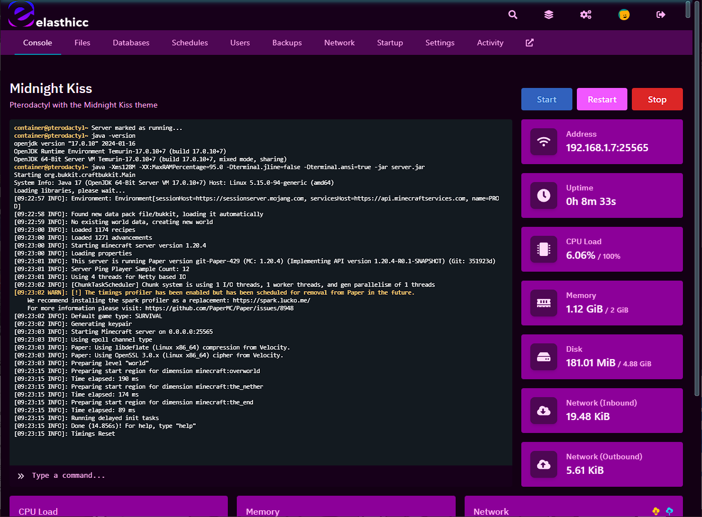

  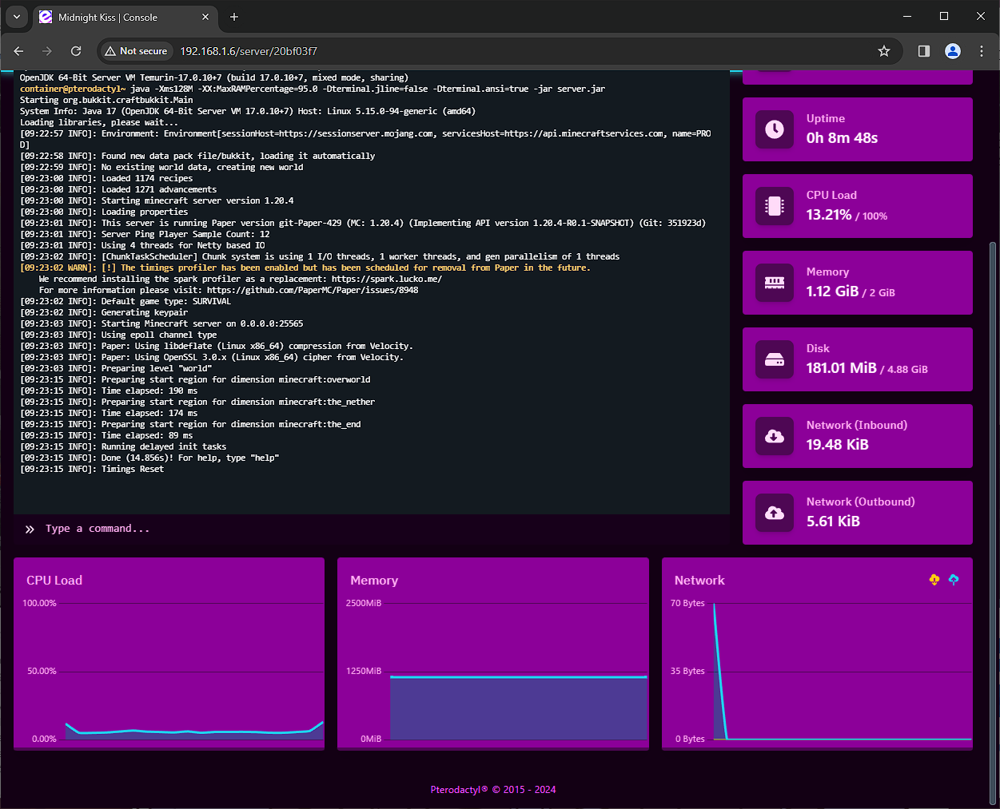
  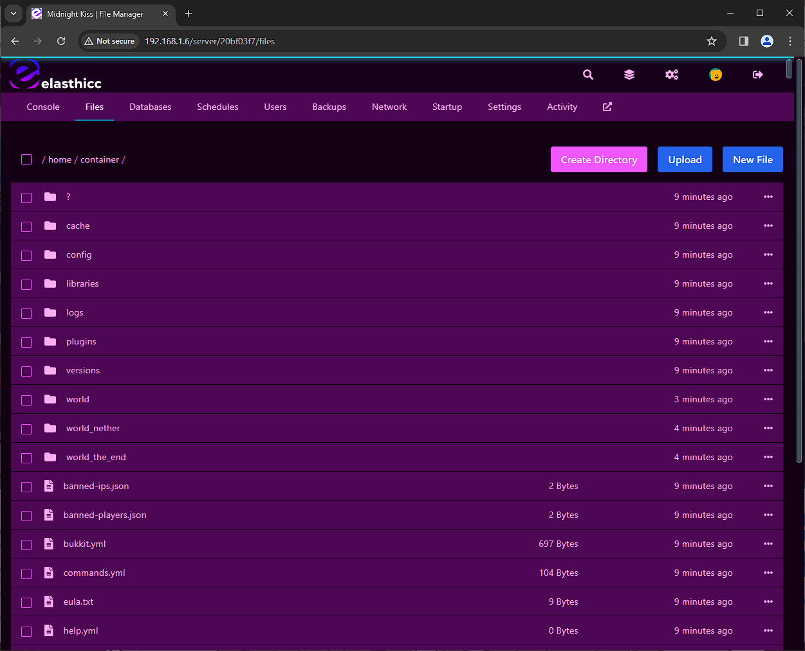
  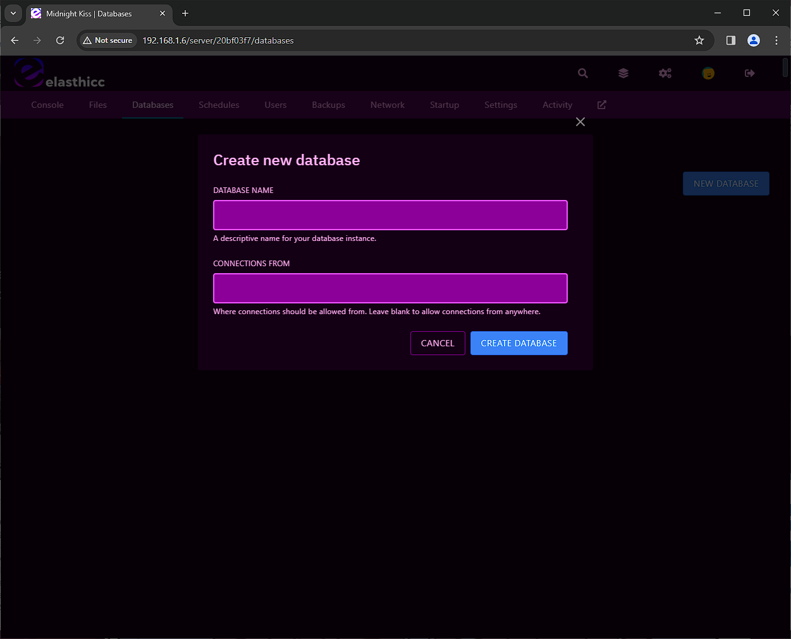

  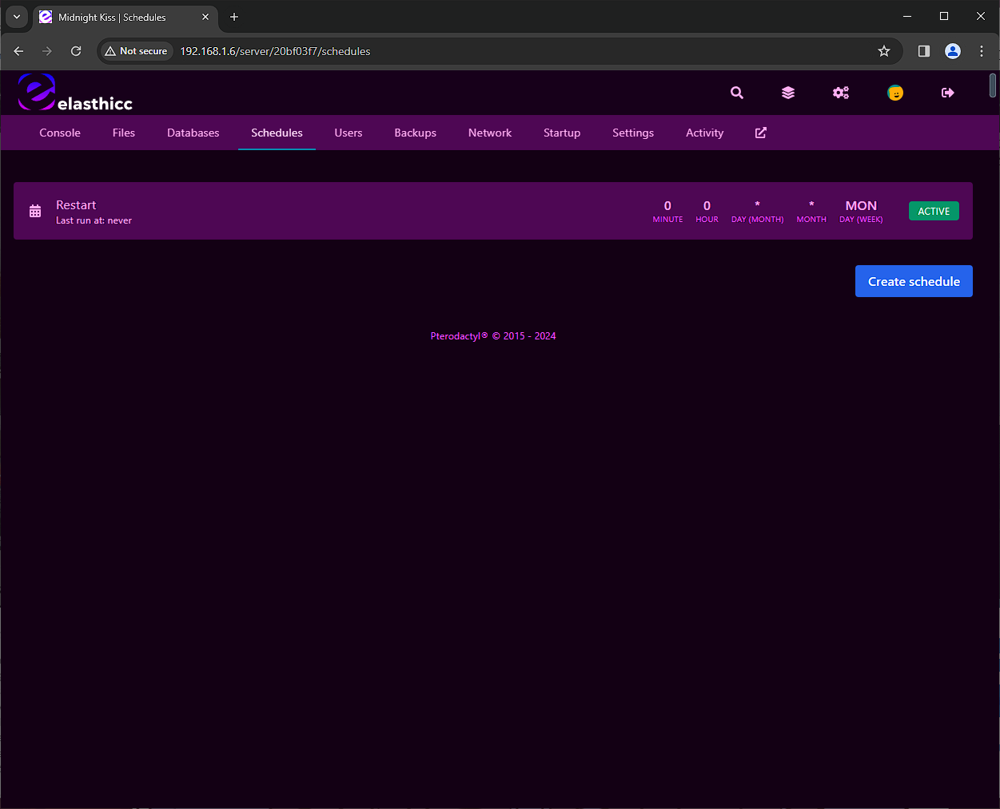
  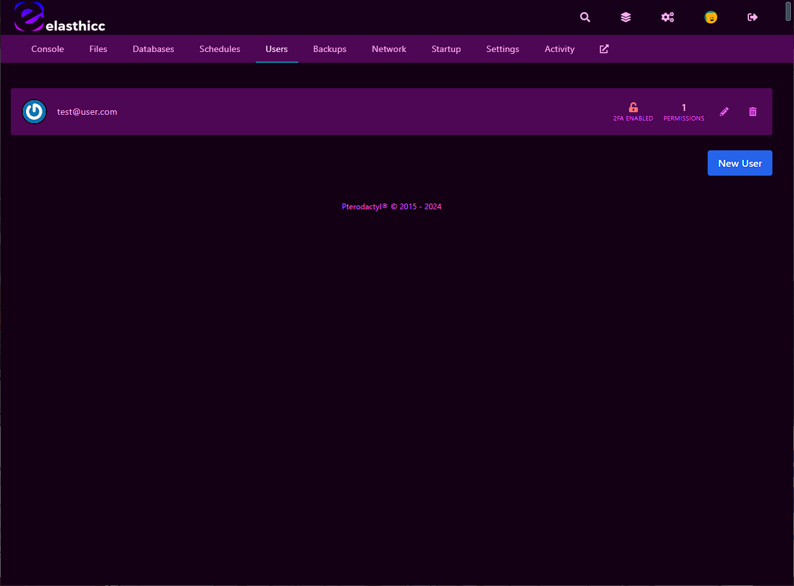
  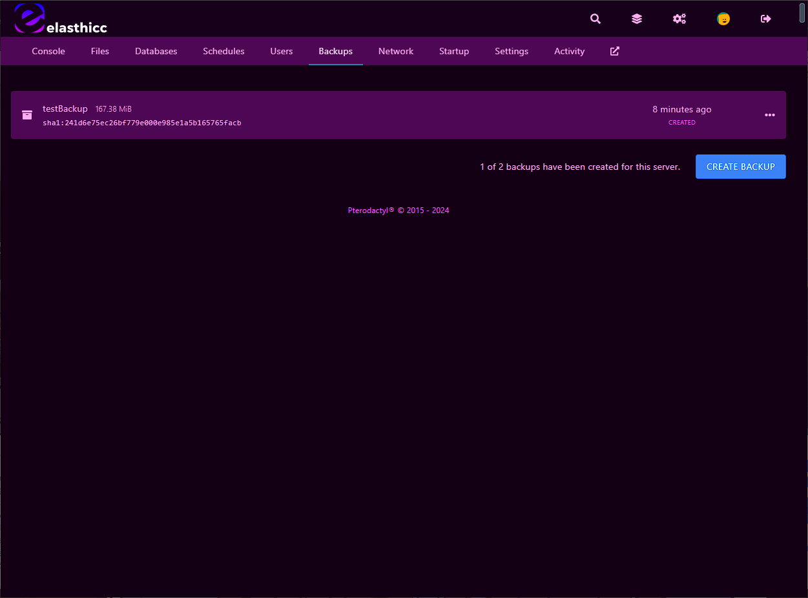

  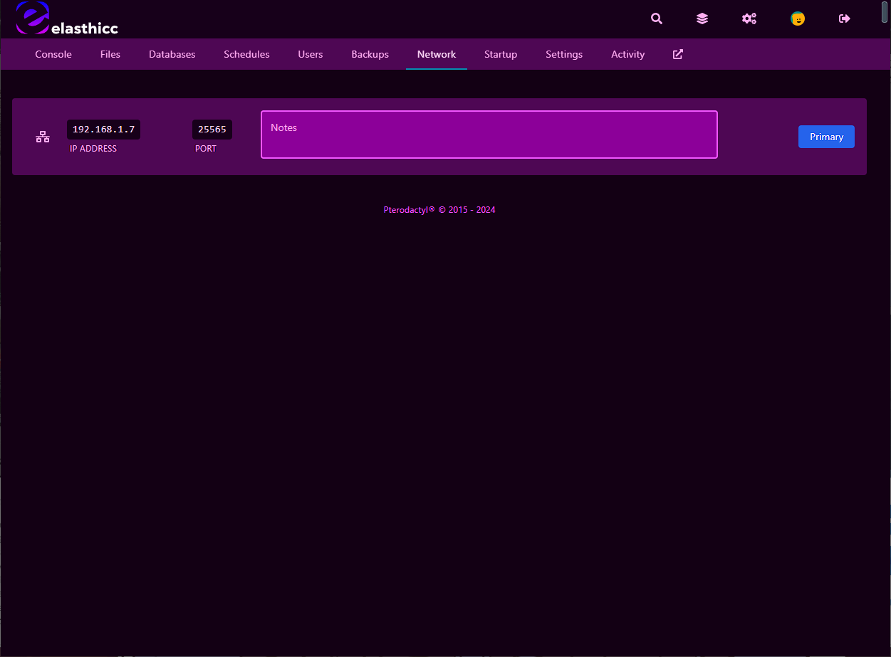
  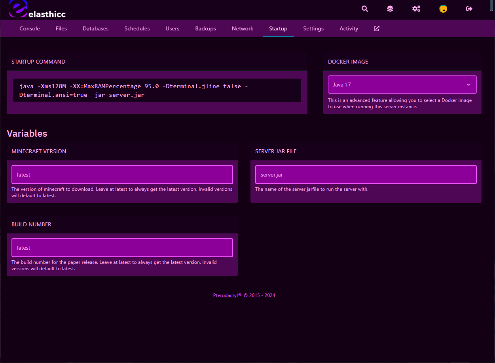
  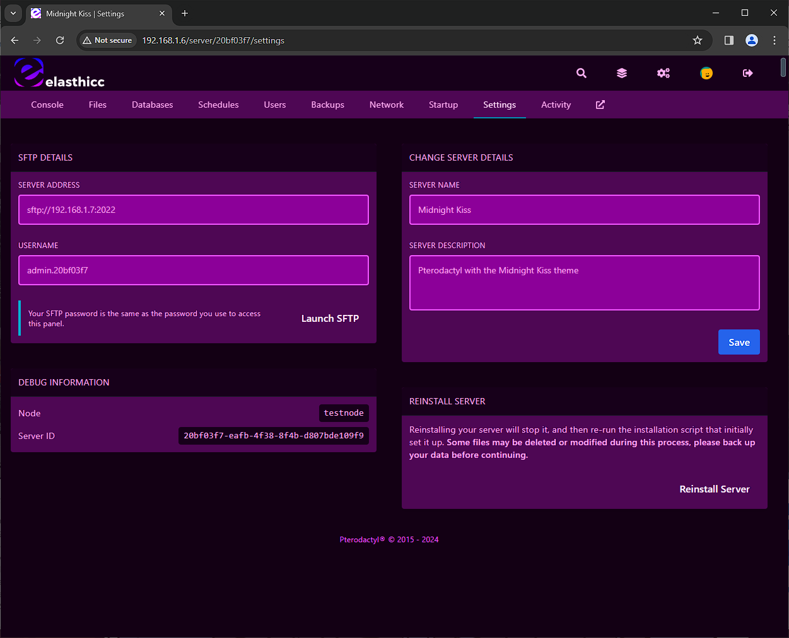
  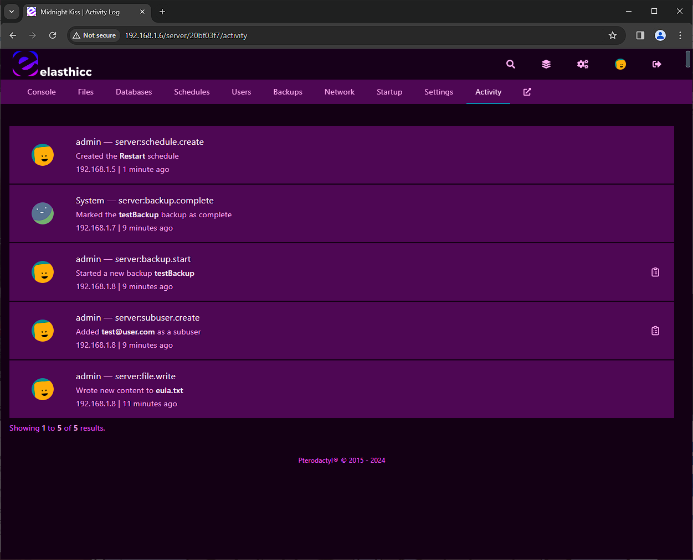

## Known issues
In firefox private windows the console text may not render properly as shown below. This is not a theme issue but a much wider issue related to Firefox. 

  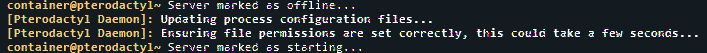

## Contributing
If you have any issues with this theme feel free to post an issue, and as always feel free to fork this repo and customize it to your liking! 

###### :nail_care: If you are curious about our plans checkout [elasthi.cc](https://elasthi.cc)!
