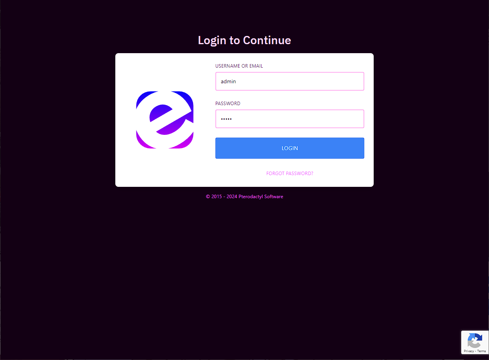
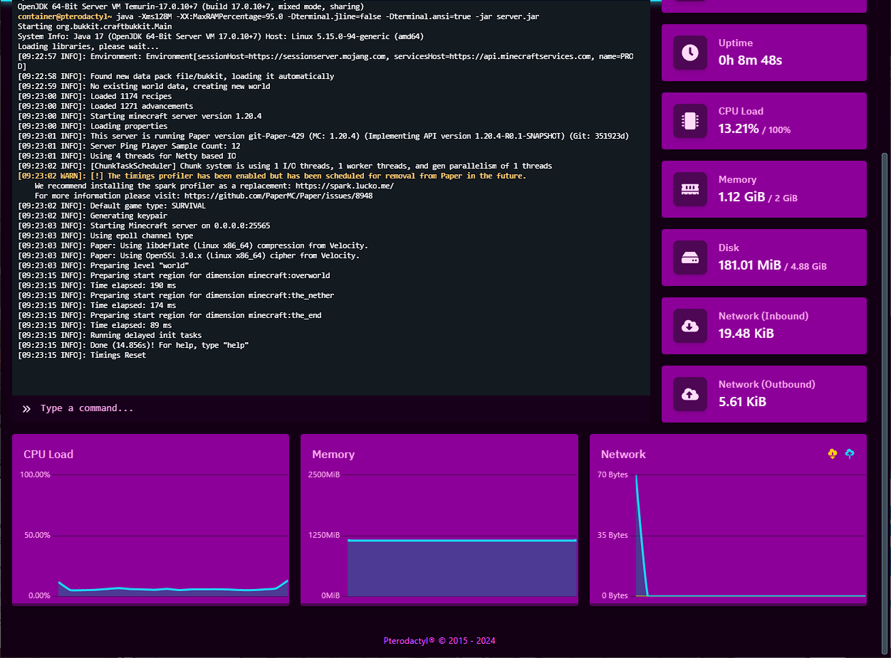
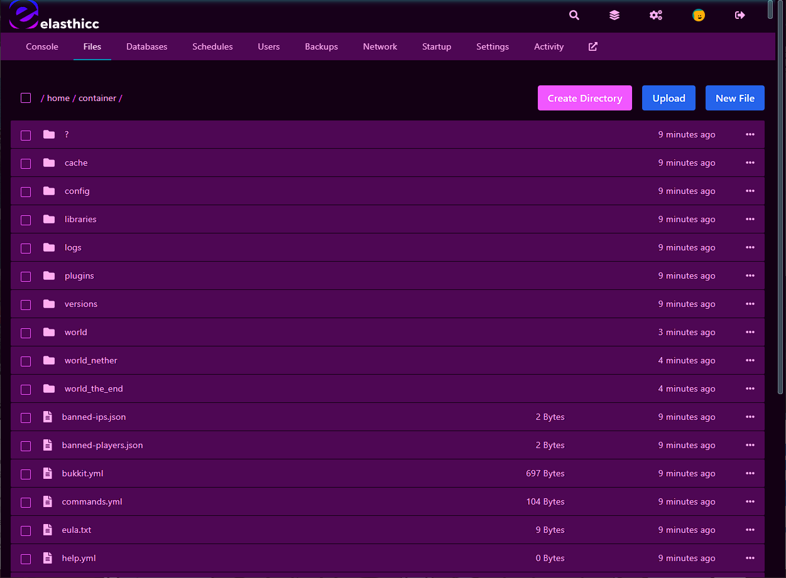
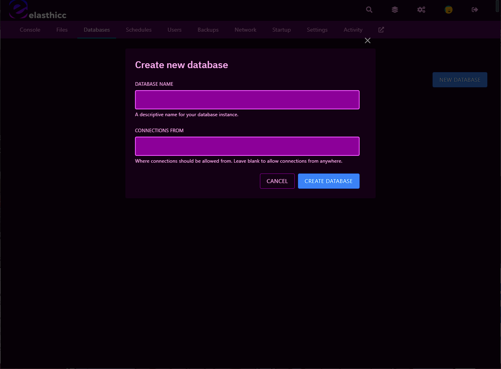
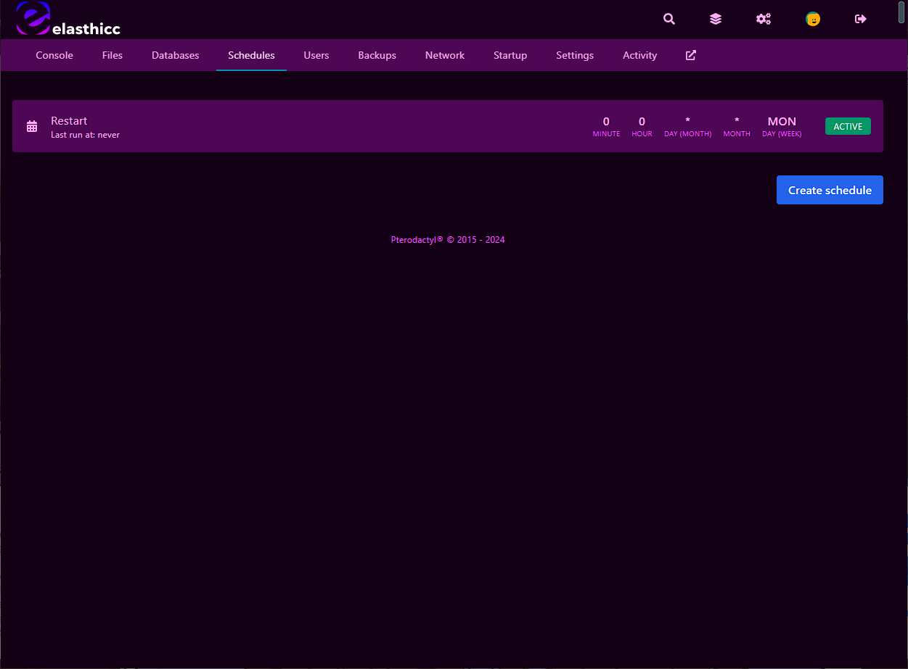
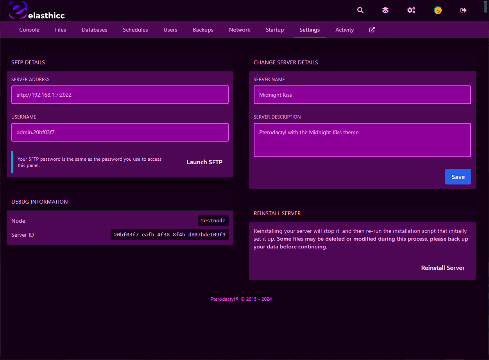
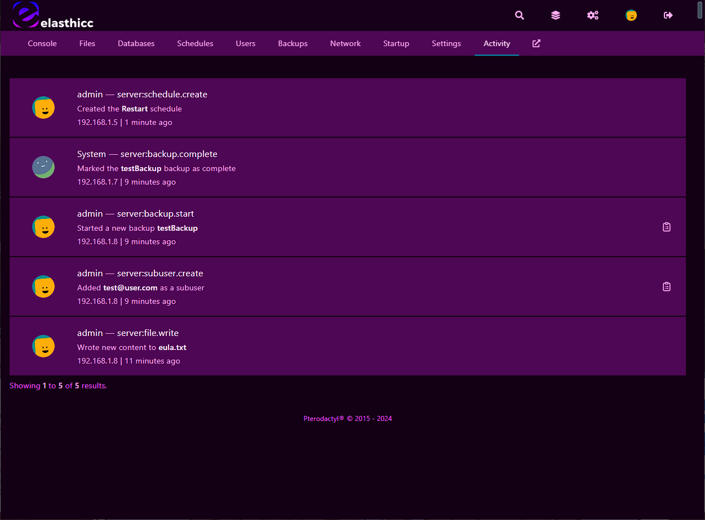

# Midnight Kiss
### A theme by elasthicc
Midnight kiss is a theme for the [Pterodactyl Panel](https://github.com/pterodactyl) developed by the team here at [elasthicc](https://elasthi.cc). This is a dark mode focused theme designed for pterodactyl 1.0+ which includes curated material design colors that are effective and pleasing to the eyes.

  

## Installing
Simply replace the files found in the `panel/` directory into your pterodactyl directory, usually found in `/var/www/pterodactyl/`. You will need to rebuild your panel assets, check out [this guide](https://pterodactyl.io/community/customization/panel.html) if you are unfamiliar.

## Examples

  
  
  

  
  
  

  
  
  

  
  
  
  

## Known issues
In firefox private windows the console text may not render properly as shown below. This is not a theme issue but a much wider issue related to Firefox. 

## Contributing
If you have any issues with this theme feel free to post an issue, and as always feel free to fork this repo and customize it to your liking! 

###### :nail_care: If you are curious about our plans checkout [elasthi.cc](https://elasthi.cc)!